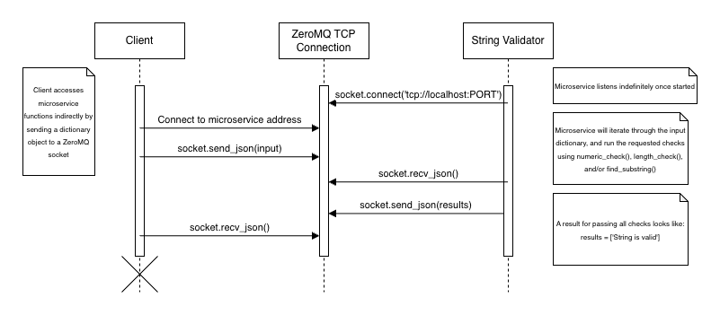

# String Validation Service

This microservice serves to validate user string input in a customizable way using ZeroMQ sockets. It is part of the "small pool" of microservices for CS_361 Fall 2025 Group 8

## Installation

1. Clone the repo
2. Make sure you have installed the ZeroMQ python library. It can be installed by entering the following command in the terminal:

    ```$ python3 -m pip install pyzmq```

3. In your code editor, change the address in socket.bind() near the top of main() to the desired address and port. Default is 1234.
4. In the terminal, navigate to the directory and enter the following command:

    ```$ python3 main.py```

5. The program is now ready to receive and send requests!

## Communication Contract

To request string validation, first connect to the program through ZeroMQ. In your code, add

```
context = zmq.Context()
socket = context.socket(zmq.REQ)
socket.connect('tcp://localhost:1234')
```

* Make sure that you use the address that you set up in main.py

To prepare your request, add your string to a python dictionary using the following format:

```input = ('input': 'This is the string to be tested')```

Use the following method to add parameters to your request:

```
input['numeric'] = 'check'
input['substring'] = 'substring to look for'
input['min'] = '2'
input['max'] = '19'
```

After your request is configured to your liking, send it using the following code:

```socket.send_json(input)```

To receive the response, use the following code:

```results = socket.recv_json()```

The string validation program will send a python array whose first value specifies whether or not the string is valid.
If the string is not valid, additional values will specify what check(s) that it did not pass.

### Example

In your program:

```
context = zmq.Context()
socket = context.socket(zmq.REQ)
socket.connect('tcp://localhost:1234')
input = {'input': 'This is a string to be tested', 'substring': 'chocolate', 'min': '4', 'max': 6, 'numeric': 'check'}

socket.send_json(input)
results = socket.recv_json()

for item in results:
    print(item)
```

This prints the following to the console:

```
String is not valid
'Chocolate' not in string
String is not strictly numeric
String does not meet length requirements
```

## UML Sequence Diagram

The following UML Sequence Diagram specifies the communication between the program and a requesting client


